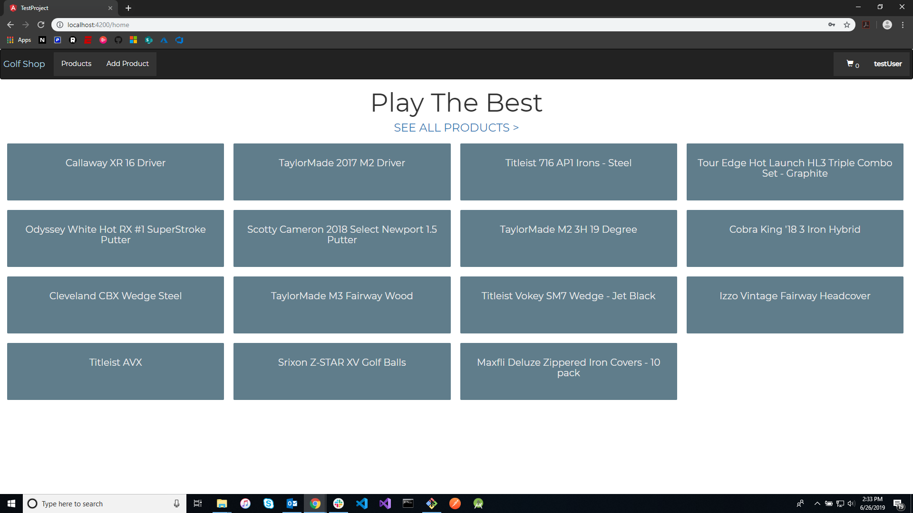
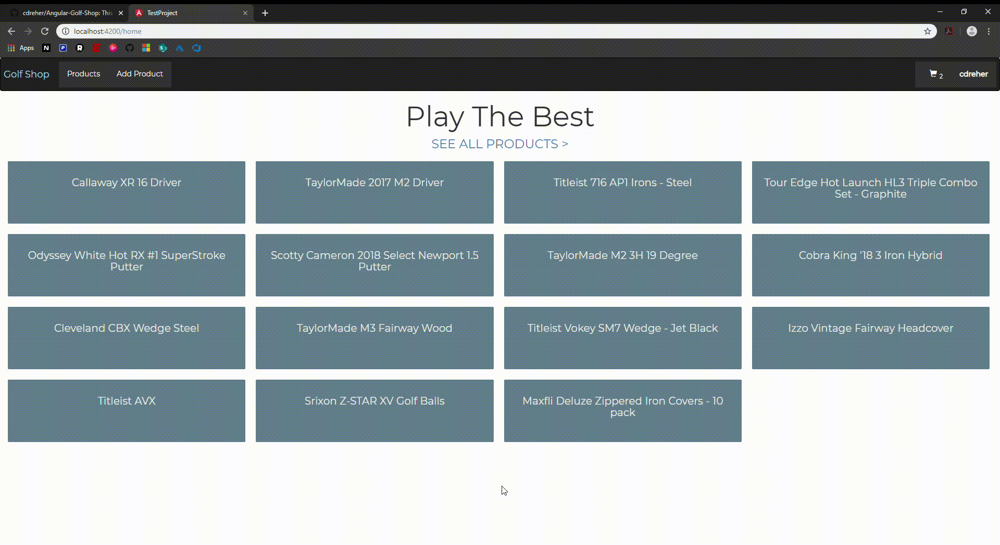

# Angular-Golf-Shop
This is a basic golf shop, developed with Angular 5 CLI & Visual Studio Code. Users can "purchase" products by adding them to the cart. They can also add a new product to the database. This application uses an in-project API for HTTP Requests.

## Overview
- everything is locally stored on an in-memory-database server, such as **users and products**
- the users are locally stored, so each time the server is refreshed, you will have to recreate your account
- at every refresh, you will have to log in (**sorry**) 

## Home Page
The landing page was set up using basic Angular principles, coupled with bootstrap styling. Each product card is wired with Angular routing.

  
 

&nbsp;  

## Login & User Details
This endpoint return the details of a given user.
    
* Once the user is authenticated, all of their details can be accessed.    
* **HTTP Request:** `GET api/users/<ID>`
* **Query Parameters:**

    | Parameter | Description               |
    | :---------|:-------------------------|
    | ID      | The ID of the user. |
&nbsp;

  
 

&nbsp;

## Register
This endpoint adds a user to the database.
    
* **HTTP Request:** `POST api/users/<ID>`
* **POST Parameters:**

    | Parameter | Description               |
    | :---------|:-------------------------|
    | url      | The url of the API. |
    | user  | The user that is being added to the database. |
    | httpOptions  | HTTP options data type used for posting. |
&nbsp;

  
 

&nbsp;

## Products Page
This endpoint returns all products in the database.

* Products can be filtered using any of the buttons on the left panel, OR by searching.
* **HTTP Request:** `GET api/products`
* **Query Parameters:**

    | Parameter | Description               |
    | :---------|:-------------------------|
    | null      | There are no query parameters for this request. |

&nbsp;  

  
 

&nbsp;  

## Product Details
This endpoint returns details for a specified product.

* A product can be added to a user's cart.
* **HTTP Request:** `GET api/products/<ID>`
* **Query Parameters:**

    | Parameter | Description               |
    | :---------|:------------------------- |
    | ID      | The ID of the product to return. |

&nbsp;  

  
 

&nbsp;  

## Add Product
This endpoint adds a given product to the database.

* **HTTP Request:** `POST api/products/<ID>`
* **POST Parameters:**

    | Parameter | Description               |
    | :---------|:-------------------------|
    | url      | The url of the API. |
    | product  | The product that is being added to the database. |
    | httpOptions  | HTTP options data type used for posting. |
    
&nbsp;

  
 

&nbsp;

## Cart
This represents the shopping cart of the user. The user can edit, remove, or change the amount of an item in their cart.
    
&nbsp;

  
 

&nbsp;
